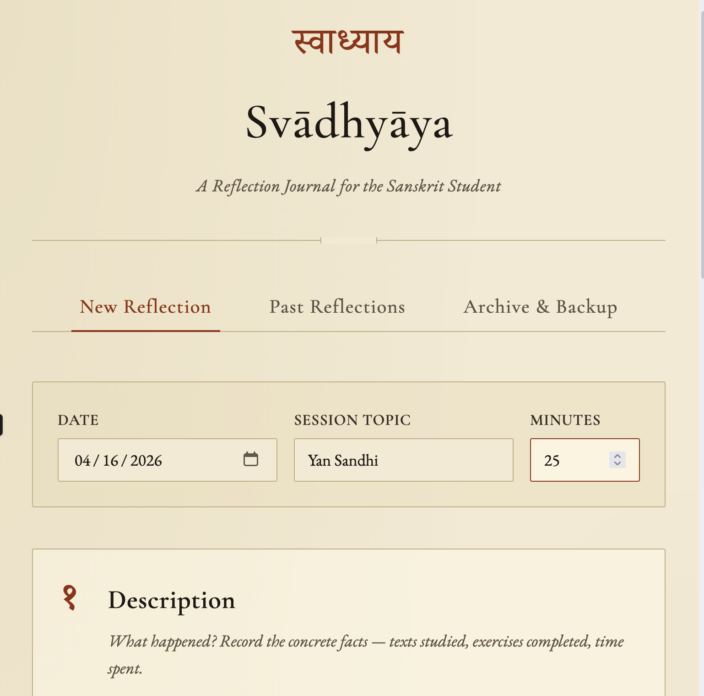

# Svādhyāya

*A structured reflection journal for Sanskrit learners, built around Gibbs' Reflective Cycle.*

**[Try it →](https://tadigotla.github.io/svadhyaya/)** · No account. No sign-up. Your data stays in your browser.

---

## What this is

A single HTML file. Open it in any browser and you have a private journal that walks you through the six stages of Gibbs' Reflective Cycle after each Sanskrit study session:

1. **Description** — What happened?
2. **Feelings** — What were you thinking and feeling?
3. **Evaluation** — What worked and what didn't?
4. **Analysis** — Why did it go that way?
5. **Conclusion** — What have you learned?
6. **Action Plan** — What will you do next?

All reflections are saved to your browser's `localStorage`. You can export them as JSON (for backup or transfer) or as Markdown (for reading and sharing).

## Why this exists

Most language-learning journals are either unstructured free-text diaries or rigid tracker apps that reduce learning to streaks and counts. Sanskrit rewards a different approach. Progress is often invisible day-to-day — a śloka that bewildered you in March suddenly parses in May — and the obstacles are rarely about hours logged. They're about which techniques are actually transferring, which ones just *feel* productive, and where foundational gaps keep surfacing as new problems.

Gibbs' Reflective Cycle gives you a framework for that kind of honest audit. And `svādhyāya` (स्वाध्याय), self-study and self-examination, is itself a concept the tradition holds in high regard — so the practice of reflecting on Sanskrit study is continuous with the spirit of Sanskrit study.

## How to use it

**Online:** visit the [GitHub Pages link](https://tadigotla.github.io/svadhyaya) above.

**Offline:** download `index.html` and open it in your browser. That's it. No server, no build step, no installation. Bookmark the file or pin it to a folder you see often.

**Suggested rhythm:**
- *Micro-cycle* — a quick 5-minute reflection after each study session. Even skipping fields is fine; the structure still does its work.
- *Macro-cycle* — once a month, re-read your journal. Look for recurring frustrations, techniques that keep appearing as effective, areas you keep avoiding.

## Privacy & data

Everything lives in `localStorage` on your device. No network requests. No analytics. No telemetry. The HTML file is fully self-contained except for Google Fonts — if you want to go fully offline, download the font files and embed them, or accept the system font fallbacks.

Because `localStorage` is tied to one browser on one device, **export a JSON backup regularly**. The Archive & Backup tab has a one-click download. Save it to a cloud drive or email it to yourself.

To move between devices: export JSON on device A, open the app on device B, import the JSON.

## Non-goals

Keeping the scope narrow is a feature. This project will not add:
- User accounts, authentication, or cloud sync
- A backend of any kind
- Mobile-native apps
- Build tooling, frameworks, or dependencies beyond the single HTML file
- Gamification, streaks, or progress metrics
- AI-generated reflections or feedback

If you want any of these, fork it — the MIT license is built for exactly that.

## Adapting for other languages

The structure has nothing Sanskrit-specific about it beyond the styling and the Devanagari numerals. Forks for Pali, Latin, Classical Greek, Biblical Hebrew, Classical Chinese, or modern language learning are welcome. The changes needed are mostly in two places:
- The hero title and font imports
- The example placeholder text in the form

## Credits

The reflective model is from Graham Gibbs' *Learning by Doing: A Guide to Teaching and Learning Methods* (Oxford Further Education Unit, 1988). The cycle is widely used in nursing, teaching, and professional development; this project adapts it for independent language study.

Epigraph from the Taittirīya Upaniṣad, Śikṣā Vallī: *svādhyāyān mā pramadaḥ* — "Do not neglect your own study."

## Contributing

This is a small tool maintained in spare time. Pull requests for bugs are welcome. Feature requests will mostly be closed with a friendly pointer to the Non-goals section above — not out of unwillingness, but because the tool's restraint is what makes it useful. Forks are encouraged.

## License

MIT — see [LICENSE](LICENSE).
